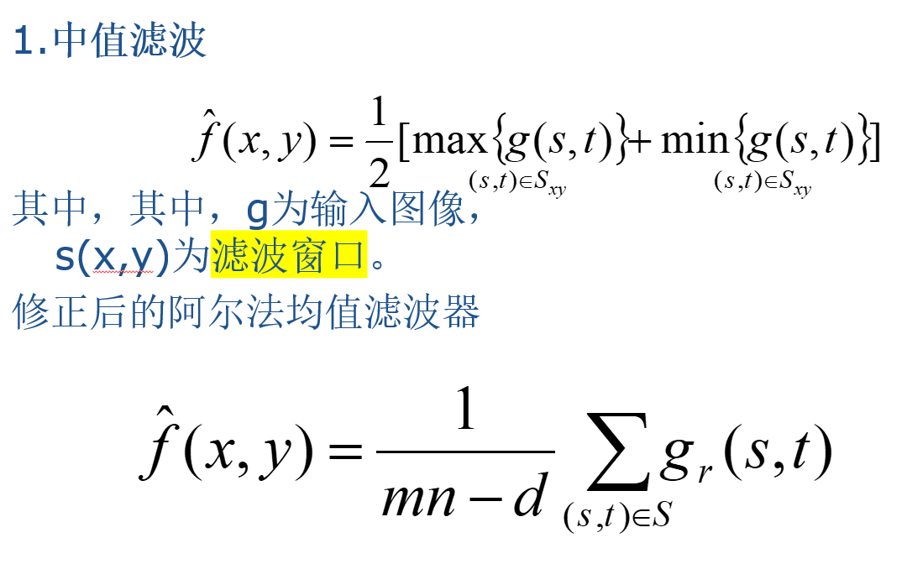
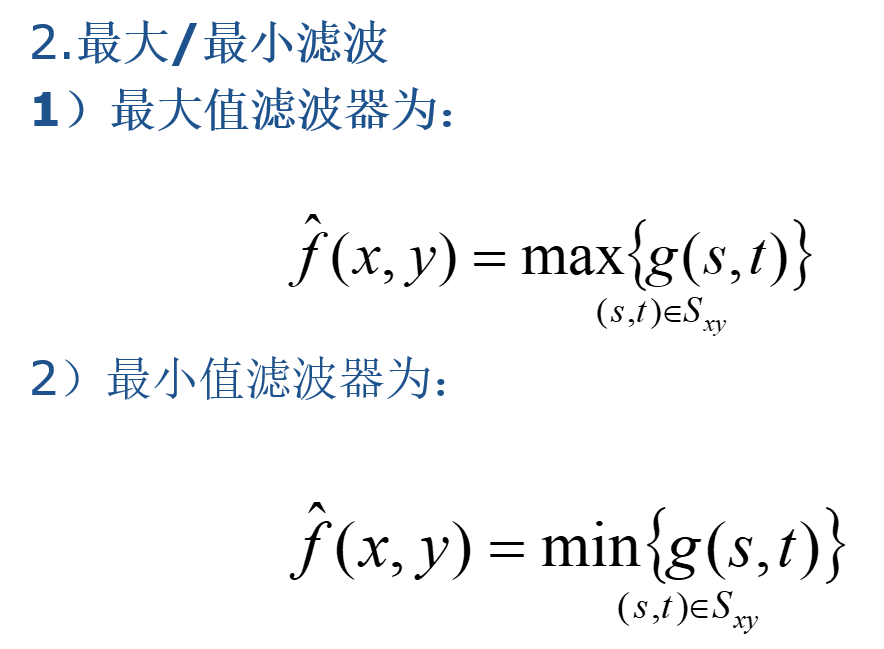

# 图像处理复习

## 第一章、数字图像处理概述

- 数字图像的定义

- 图像处理的过程
  
  

- 图像处理的研究内容
  
  

## 第二章、数字图像处理的基础

- 图像的存储
  
  计算图像存储的大小，每个像素占的位数乘以像素个数
  
  一张512*512的8bit灰度级lena图像
  
  512\*512\*8bit = 256 KB

- **邻接问题（后面查课本定义）**
  
  [数字图像处理——4邻接、8邻接、m邻接_泼夫的博客-CSDN博客_m邻接](https://blog.csdn.net/Clover_pofu/article/details/104987717)
  
  ①    4邻接:如果q在N_4(p)集中,具有v中数值的两个像素p和q是4邻接的.
  
  ②    8邻接:如果q在N_8(p)集中,则具有v中数值的两个像素p和q是8邻接的.
  
  ③    M邻接(混合邻接):如果①q在N_4(p)集中,或者②q在N_D中且集合N_4(p)∩N_4(q)没有v值的像素,则具有v值的像素p和q是m邻接的.

- 二值图像
  
  

- 距离
  
  

- 灰度级数和表示位数
  
  

## 第三章、图像基本运算的概述

- 基本运算
  
  

- 点运算
  
  点运算是指对一幅图像中每个像素点的灰度值进行计算的方法。

- 代数运算和逻辑运算
  
  对多幅图像中的像素点进行代数运算和与或非等逻辑运算

- 几何运算
  
  对图像的位置的变换（平移、镜像、旋转）、大小（缩放）、复合变换。
  
  非线性变换点运算
  
  
  
  

## 第四章、图像变换

傅里叶变换中,频谱里低频部分表示什么,高频部分表示什么.为什么要进行离散傅里叶变换?图像的空间和灰度值是否是离散的?

- 频谱图上看到的明暗不一的亮点，实际上是图像上某一点与邻域点差异的强弱，即梯度的大小，也即该点的频率的大小（图像中的低频部分指低梯度的点，高频部分相反）

**图像灰度变化缓慢的区域，对应它变换后的低频分量部分；图像灰度呈阶跃变化的区域，对应变换后的高频分量部分。除颗粒噪音外，图像细节的边缘、轮廓处都是灰度变化突变区域，它们都具有变换后的高频分量特征。**

低频：灰度值变化小的

高频：灰度值变化剧烈的

实际工程应用中，多数情况下要借助计算机等数字工具对采样量化后的离散数据序列进行分析和处理，这就要用到**离散傅里叶变换**

## 第五章、图像增强

- 目的：采用某种技术手段，改善图像的视觉效果，或将图像转换成更适合于人眼观察和机器分析识别的形式，以便从图像中获取更有用的信息。

- 方法：
  
  1. 空间域方法：“空间域”是指图像平面自身，这类方法是以对图像的像素直接处理为基础的。
     
     
     
     
  
  2. 频域方法:“频域”处理技术是以修改图像的傅氏变换为基础的。

- 什么是灰度级直方图
  
  - 图像的一种统计表达，反映图中不同灰度级出现的统计概率
  
  - 特点：改变图像像素的空间分布
  
  - 直方图均衡计算
    
    - 定义：通过图像灰度直方图均衡化处理,使得图像的灰度分布趋向均匀,图像所占有的像素灰度间距拉开,加大了图像反差，改善视觉效果,达到增强目的。
    
    - 接近某一级的进行合并
    
    - 步骤：
    
    - 例子：
      
      

- 图像锐化的方法：
  
  锐化就是要增强图像的频谱的高频部分，而图像边缘占据高频部分，边缘增强属于高通滤波，相当于减去低频分量
  
  1. 梯度锐化法（梯度算子、Roberts、Prewitt、Sobel算子计算梯度）
  
  2. 拉普拉斯算子
  
  3. 低频分量消减法

- 高通滤波
  
  - 定义：使图像中的高频分量通过高频滤波器，使低频成分削弱，再经过傅里叶逆变换得到边缘锐化的图像。

## 第六章、图像复原

- 均值滤波：
  
  - 
    
    

- 中值滤波
  
  

- 最大值/最小值滤波
  
  

## 第七章、图像压缩

- 图像冗余：
  
  1. 空间冗余
  
  2. 时间冗余
  
  3. 视觉冗余
  
  4. 信息熵冗余
  
  5. 结构冗余
  
  6. 知识冗余

## 第八章、图像分割

- 边缘检测
  
  - 定义：对图像中灰度发生突变或不连续的微小区域（具有相对不同灰度值特性的区域边界）进行检测

- 给定一个梯度算子，确定其所求梯度的方向

## 第九章、彩色图像

- RGB模型
  
  - 定义：RGB模型是目前常用的一种彩色信息表达方式，它使用红、绿、蓝三原色的亮度来定量表示颜色。
  
  - 该模型也称为加色混色模型，是以RGB三色光相互叠加来实现混色的方法

- HSI模型
  
  - 定义：H定义颜色的波长,称为色调; S表示颜色的深浅程度,称为饱和度; I表示强度或亮度.

- RGB模型在哪里应用最多?
  
  - RGB的应用很广泛，主要是在LED领域，屏幕显示和视频的输出等方式。多存在于电子显示屏、投影仪、数码相机、扫描仪等媒介

- 伪彩色处理
  
  - 是指将灰度图像转化为彩色图像,或者将单色图像变换成给定彩色分布的图像. 其主要目的是提高人眼对图像细节的分辨能力,以达到图像增强的目的.
