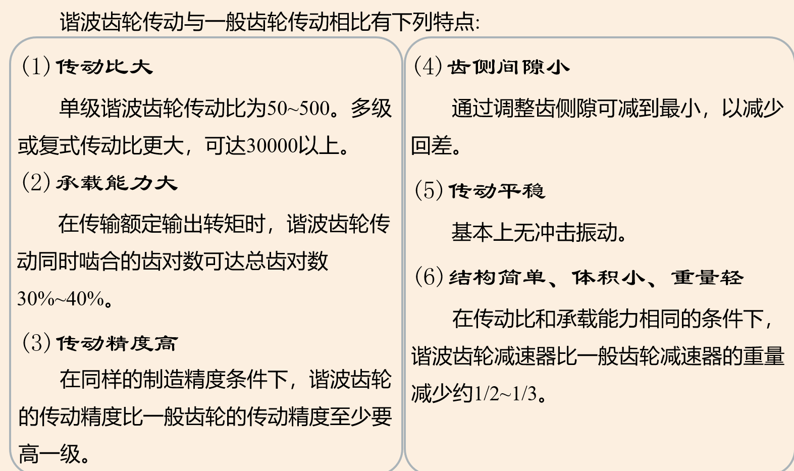

# 复习重点内容

1.        机电一体化的理论基础（系统工程、控制论和信息论）。

- 系统工程、控制论和信息论

2.        机电一体化系统的基本要素和相关技术。**（*************）**

- 基本要素：
  
  机械本体、动力部分、传感检测部分、执行部分、驱动部分、控制及信息处理部分、各要素和环节之间相联系的接口。

- 相关技术可以归纳为六个方面:机械技术、传感检测技术、信息处理技术、自动控制技术、伺服传动技术和系统总体技术

3.        现代机械的机电一体化**目标**。

- 综合利用机、电、信息、控制等各种相关技术的优势，扬长避短，以达到系统优化效果，取得显著的社会效益和技术经济效益。
  
  1. 提高精度
  
  2. 增强功能
  
  3. 提高生产效率，降低成本
  
  4. 节约能源，降低能耗
  
  5. 提高安全性、可靠性
  
  6. 改善操作性和实用性
  
  7. 减轻劳动强度，改善劳动条件
  
  8. 简化结构，减轻重量
  
  9. 降低价格
  
  10. 增强柔性应用功能

4.        数控机床进给系统中基本物理量的折算（转动惯量、粘性阻尼系数、刚度系数）。**（*************）**

- 转动惯量：关键就是能量守恒，然后把所有的速度都转换为w1
  
  
  
  > tip:建立速度关系是根据时间相等L/v = 2π/w

- 粘性阻尼系数：根据能量守恒，换算到用轴1的速度下表示的粘性阻尼系数
  
  

- **刚度系数**：考虑了工作台导致的丝杆转角形变，考虑后通过力矩和运动关系，利用角度列等式，换算到轴1上
  
  

5.        机械系统的摩擦（粘性摩擦力、库仑摩擦力、静摩擦力）的特点。**（*************）**

- 三者的共性：方向均与运动方向(或有运动趋势方向)相反
  
  - 粘性摩擦力：和物体运动的相对速度成正比
  
  - 库伦摩擦力：接触面对**运动物体**的阻力，大小为一常数
  
  - 静摩擦力：静摩擦力是有相对运动趋势但仍处于静止状态时摩擦面间的摩擦力，其最大值发生在相对运动开始前的一瞬间，运动开始后静摩擦力即消失。
    
    

6.        齿轮消隙机构的方法、丝杠螺母调隙机构的方法。**（*************）**

- 齿轮消隙机构的方法
  
  刚性消除法
  
  - 偏心轴套式消隙机构
  
  - 锥度齿轮消隙结构
  
  - 斜齿圆柱齿轮消隙机构
  
  柔性消除法
  
  - 双齿轮错齿式弹簧消隙机构
  
  - 碟形弹簧消除斜齿圆柱齿轮消隙机构
  
  - 锥齿轮传动压力弹簧消隙机构

- 丝杠螺母调隙机构
  
  - 垫片式调隙机构
  - 螺纹式调隙机构
  - 齿差式调隙机构

7.        齿轮传动总传动比及各级传动比分配的选择原则（小功率传动装置的最小等效转动惯量和质量最小原则下各级传动比分配原则的证明）。**（*************）**

- 以谁为原则就把谁表示出来，然后消元求对传动比i的偏导
- 都是需要折算或者转换消元

8.        谐波齿轮的核心部件，原理及特点。**（*************）**

- 核心部件：第二章ppt（P71）
  
  输入轴、波形发生器凸轮、柔轮、柔性轴承、刚轮

- 原理：外装柔性轴承4的波发生器凸轮3装入柔轮2中，使原形为圆环形的柔轮产生弹性变形，柔轮两端的齿与刚轮的齿完全啮合，而柔轮短轴两端的齿与刚轮的齿完全脱开，长轴与短轴间的齿侧逐渐啮入和啮出。当高速轴带动波发生器凸轮和柔性轴承逆时针连续转动时，柔轮上原来与刚轮啮合的齿对开始啮出后脱开，再转入啮入，然后重新啮合，这样柔轮就相对于刚轮沿着与波发生器相反的方向低速旋转，通过低速轴输出运动。

- 特点：PPT（P76）
  
  

9.        支承部件的定义。

- 支承、固定和联接系统中的其他零部件，还要保证这些零部件之间的相对位置要求和相对运动的精度要求，而且还是伺服系统的组成部分。

10.     传感器静态特性（线性度、灵敏度、迟滞和重复性）和动态特性。

- 第三章PPT （P9-P14）

11.     光栅（莫尔条纹原理及计算）、光电编码器、直流测速机的原理；感应同步器（鉴相式和鉴幅式）原理的证明。**（*************）**

- 光栅PPT P43
  
  计算：
  
  
  
  

- 感应同步器把滑尺相对定尺的位移L的变化转成感应电势相角θ的变化。因此，只要测得相角θ，就可以知道滑尺的相对位移
  
  
  
  W为绕组节距，鉴相式（测量相位）和鉴幅式（测量电压）就是θ在相位还是在幅值的区别

- 直流测速机：当转子在磁场中旋转时，电枢绕组中即产生交变的电势，经换向器和电刷转换成与转子速度成正比的直流电势。

- 光电编码器：缝隙圆盘随被测轴转动时，由于圆盘上的缝隙间距与指示缝隙的间距相同，因此圆盘每转一周，光电器件输出与圆盘缝隙数相等的电脉冲，根据测量时间t内的脉冲数N，则可测出转速为

1.        测量放大器的电路及原理。**（*************）**

- 

- 两个放大器作为差动输入，A3作为差动跟随器

2.        传感器非线性补偿软件处理方法（计算法、查表法和插值法）的原理。

- 计算法：输出电信号与传感器的参数之间有确定的数字表达式时，就可采用计算法进行非线性补偿

- 查表法：把事先计算或测得的数据按一定顺利编制成表格，查表程序的任务就是根据被测参数的值或者中间结果，查出最终所需要的结果。

- 插值法：把该曲线按一定要求分成若干段，然后把相邻两分段点用直线连起来(如图中虚线所示)，用此直线代替相应的各段曲线，即可求出输入x所对应的输出值y。

3.        数字滤波（算术平均值法、中值滤波法、防脉冲干扰平均值法、程序判断滤波法）。

- 算术平均值法：周期N，取前N次的平均值作为本次采样的结果

- 中值滤波法：中值滤波法是在三个采样周期内，连续采样读入三个检测信号X1、X2、X3，从中选择一个居中的数据作为有效信号，以算式表示为
  
   若X1<X2<X3，则为X2有效信号。

- 防脉冲干扰平均值法：将算术平均值法和中值滤波法结合起来，便可得到防脉冲干扰平均值法。它是先用中值滤波原理滤除由于脉冲干扰引起的误差的采样值，然后把剩下的采样值进行算术平均。

- 程序判断滤波法：相邻差值不能超过一定值
  
  常取ΔX0=(|X1-X2|+|X2-X3|)/2限速滤波法较为折中，既照顾了采样的实时性，也照顾了采样值变化的连续性。

4.        伺服的含义，伺服控制系统（控制器+功率放大器+执行机构+检测装置）。

- 伺服(Servo)的意思即“伺候服侍”，就是在控制指令的指挥下，控制驱动元件，使机械系统的运动部件按照指令要求进行运动。

- 伺服控制系统：第四章PPT （P6-P7）
  
  - 控制器：控制器的主要任务是根据**输入信号和反馈信号**决定控制策略。常用的控制算法有PID(比例、积分、微分)控制和最优控制等。控制器通常由电子线路或计算机组成。
  
  - 功率放大器：伺服系统中的功率放大器的作用是**将信号进行放大**，并用来**驱动执行机构**完成某种操作。在现代机电一体化系统中的功率放大装置，主要采用各种电力电子器件组成。
  
  - 执行机构：执行机构主要由**伺服电动机**或**液压伺服机构**和**机械传动装置**等组成。目前，采用电动机作为驱动元件的执行机构占据较大的比例。伺服电动机包括步进电动机、直流伺服电动机、交流伺服电动机等。
  
  - 检测装置：检测装置的任务是**测量被控制量(即输出量)**，实现**反馈控制**。伺服传动系统中，用来检测位置量的检测装置有：自整角机、旋转变压器、光电码盘等，用来检测速度信号的检测装置有：测速发电机、光电码盘等。

5.        直流电机、交流电机、步进电机的原理及种类。**（*************）**

- 直流电机
  
  - 原理：通直流电，需要电刷换向或者电子换向使转子能连续转动
  
  - 种类：**永磁直流**伺服电动机、**无槽电枢**直流伺服电动机、**空心杯电枢**直流伺服电动机、**印制绕组**直流伺服电动机

- 交流电机：
  
  - 原理：
    
    - 永磁同步电动机：永磁同步伺服电动机，同步伺服电动机主要由转子和定子两大部分组成。在转子上装有特殊形状高性能的永磁体，用以产生恒定磁场，无需励磁绕组和励磁电流。在电动机的定子铁心上绕有三相电枢绕组，接在可控的变频电源上。为了使电动机产生稳定的转矩，电枢电流磁动势必须与磁极同步旋转，因此在结构上还必须装有转子永磁铁的磁极位置检测器，随时检测出磁极的位置，并以此为依据使电枢电流实现正交控制。
    
    - 异步感应交流伺服电动机，其结构分为两大部分，即定子部分和转子部分。在定子铁心中安放着空间成90°电角度的两相定子绕组，其中一相为励磁绕组，始终通以交流电压，另一相为控制绕组，输入同频率的控制电压，改变控制电压的幅值或相位可实现调速。
  
  - 种类：交流伺服电动机主要有同步型交流伺服(永磁同步)电动机和异步型交流伺服(异步感应) 电动机。

- 步进电机：
  
  - 原理：将脉冲信号转换成角位移的执行元件。对这种电动机施加一个电脉冲后，其转轴就转过一个角度，称为一步；脉冲数增加，角位移随之增加；脉冲频率高，则电动机旋转速度就高，反之则慢；分配脉冲的相序改变后，电动机便反转。
  
  - 种类：反应式步进电动机，永磁式步进电动机，永磁感应式步进电动机

6.        电气控制系统的功率放大器（变流器）种类（整流器、逆变器、变压器或变频器、斩波器）。

1) AC/DC变流器——把交流电变换成固定的或可调的直流电(也称为整流器)；

2) DC/AC变流器——把固定的直流电变成固定或可调的交流电(也称为逆变器)；

3) AC/AC变流器——把固定的交流电变成可调的交流电(包括改变电压或频率，变压器或变频器)；

4) DC/DC变流器——把固定的直流电变成可调的直流电(也称为斩波器)；

7.        开环步进电机控制系统（环形分配器、功率驱动器、步进电机及负载），步进电机环形分配的方法（计算机软件分配、小规模集成电路搭接硬件分配器、专用环形分配器）。

8.        步进电机+减速器+丝杠螺母+光电编码器+工作台的计算。**（*************）**

- 第四章PPT（P10）
  
  > tip:光学编码器在丝杆那，不是在电动机那

9.        旋转变压器、相敏放大器原理。

- 旋转变压器，旋转变压器是一种输出电压随转角变化的角位移测量装置。
  
  原理：旋转变压器的原边、副边绕组则随转子的角位移发生相对位置的改变，因而其输出电压的大小随转子角位移而发生变化,输出绕组的电压幅值与转子转角成正弦、余弦函数关系，或保持某一比例关系，或在一定转角范围内与转角成线性关系。
  
  

- 相敏放大器
  
  

--- 

10.     常用的电力电子元器件（晶闸管、功率晶体管、场效应管、绝缘栅双极型晶体管[IGBT]……）。

11.     脉宽调制型（PWM）功率放大器基本原理。

- 原理：改变导通时间τ，就可以改变电枢两端的平均电压Ud。当τ从0~T改变时， Ud由零连续增大到U。实际的PWM电路用自关断电力电子器件来实现上述的开关作用，如GTR、MOSFET、IGBT等器件。

12.     双极式H型可逆PWM变换器的原理。**（*************）**

一个开关周期内，当0≤t≤ton时，Ub1和Ub4为正，晶体管VT1和VT4饱和导通，而Ub2和Ub3为负，VT2和VT3截止。这时(+Us)加在电枢A、B两端，UAB=Us，电枢电流id沿回路1流通。当ton≤t≤T时，Ub1和Ub4变负，VT1和VT4截止；Ub2和Ub3变正，但VT2和VT3并不能立即导通，因为电枢电感释放储能形成的电流id沿回路2经VD2、VD3续流。VD2、VD3两端的压降，正好使VT2和VT3的C-E极承受反压，这时UAB=-Us。在一个周期内，UAB正负相间，这就是双极PWM变换器的特征。

双极PWM变换器的特征就是在一个周期内，电压从(+Us)变为(-Us)。那么如何来控制电动机的正转和反转呢?这只要控制正、负脉冲的宽窄。当正脉冲较宽时，ton>2/T，则电枢两端的平均电压为正，电动机正转(见图4-17的波形)。当正脉冲较窄时，ton<2/T，平均电压为负，电动机反转。如果正负脉冲宽度相等， ton=2/T，平均电压为零，则电动机不转。

13.     锯齿波脉宽调制器电路原理。**（*************）**

- Ub和Uc叠加作为和Usa比较，调整Uc可以调整占空比

14.     直流伺服电机**微分方程**推导。**（*************）**

15.     交流异步电机转速方程，变频调速原理及特性（基频以下恒磁通（恒转矩）调速、基频以上恒功率调速）。**（*************）**

- 变频调速原理：改变异步电动机的供电频率f1，可以改变其同步转速n1，实现调速运行，也称为变频调速。
  
  - 恒磁通调速：基频(电动机额定频率f1n)向下调速的情况。为了保持电动机的负载能力，应保持气隙磁通Φm不变，这就要求降低供电频率的同时降低感应电动势，保持E1/f1=常数，即保持电动势与频率之比为常数进行控制。这种控制又称为**恒磁通变频调速**，属于**恒转矩调速**方式。
  
  - 恒功率调速：基频开始向上调速的情况。频率由额定值f1n向上增大，但电压U1受额定电压U1n限制不能再升高，**只能保持U1=U1n不变**。必然会使**磁通随着f1的上升而减小**，这属于近似的**恒功率调速**方式。

16.     正弦波脉宽调制（SPWM）同步调制、异步调制和分段同步调制。**（*************）**

PPT（P87）

- 脉宽调制技术中，以所期望的波形作为调制波，而受它调制的信号称为载波。在SPWM中常用等腰三角波作为载波，因为等腰三角波是上下宽度线性对称变化的波形，它与光滑的正弦曲线相比较，得到一组等幅而脉冲宽度随时间按正弦规律变化的矩形脉冲。用三相正弦信号调制，便获得三相SPWM波形。图4-33绘出了三相SPWM逆变器工作在双极式控制方式的输出电压波形。
  
  - 同步调制：在改变f的同时成正比的改变fc，使N保持不变，则称为同步调制。同步调制的优点是可以保证输出波形对称性。对于三相系统，为保持三相之间对称，互差120°相位角，N应取3的整数倍；由于波形的对称性，不会出现偶次谐波问题。但是，当输出频率很低时，若仍保持N值不变，会导致谐波含量变大，使电动机产生较大的脉动转矩。
  
  - 异步调制：在改变f的同时，fc的值保持不变，使N值不断变化。异步调制可能使N值出现非整数，相位可能连续飘移且正、负半波不对称。当N值不能足够大时(N值的上限由逆变器功率开关器件的允许开关频率决定)，引起电动机工作的不平稳。
  
  - 分段调制：实用的GTR逆变器常采用分段同步调制的方案。图4-34是一个实例，恒转矩区，低速段采用异步调制，高速段分段同步化，N值逐级改变。到了恒功率区，取N=1，保持输出电压不变。这样，开关频率限制在一定的范围内，并且fc相对变小后，在N为各个确定值的范围内，可以克服异步调制的缺点，保证输出波形对称。

17.     模数转换量化误差，模数转换和数模转换原理及其接口组成。**（*************）**

- 模数转换量化误差：

- 模数转换
  
  - 组成：由N位寄存器、D/A转换器和控制逻辑部分组成
  
  - 原理：开始转换，首先置N位寄存器最高中位(DN-1)为“1”，其余位清“0”，寄存器的内容经D/A转换后得到整个量程一般的模拟电压VN，与输入电压VX比较。若VX>VN时，则保留DN-1=1；若VX<VN时，则DN-1位清0。然后，控制逻辑使寄存器下一位(DN-2)置“1”，与上次的结果一起经D/A转换后与VX比较，重复上述过程，直至判别出D0位取1还是0为止，此时控制逻辑电路发出转换结束信号DONE。这样经过N次比较后，N位寄存器的内容是转换后的数字量数据，经输出缓冲器读出。整个转换过程就是这样一个**逐次比较逼近**的过程。

- 数模转换
  
  - 组成：由权电阻网络、参考电压、电子开关等组成
  
  - 原理：

18.     直接数字控制，监督控制系统。

- 直接数字控制系统：计算机的运算和处理结果直接输出作用于被控对象，故称为直接数字控制系统DDC(Direct Digital Control)。

- 监督控制系统：监督控制系统(SupervisoryComputer Control)就是根据原始的生产工艺信息及现场检测信息**按照描述生产过程的数字模型，计算出生产过程的最优设置值**。输入给DDC系统或连续控制系统。

19.     模拟装置的数字化方法（直接差分法、匹配Z变换法、双线性变换法）。**（*************）**

- 直接差分法

- 匹配Z变换法
  
  

- 双线性变换法：
  
  

20.     直接差分法（向前差分法、向后差分法），*D*(*s*)和*D*(*z*)的对应关系（向前差分、向后差分、矩形积分法）。

- 向前差分法：
  
  
  
  

- 向后差分法：

- *D*(*s*)和*D*(*z*)的对应关系：
  
  
  
  

21.     工业机器人的定义、组成、重要特征及三代工业机器人（程序控制、适应性控制和智能控制）。

- 平板PPT上

22.     按操作机分类（直角坐标型、圆柱坐标型、球坐标型、多关节型和平面关节型）的工业机器人的定义及特点；按控制方式分类（点位控制、连续轨迹控制）。

- 平板PPT上

23.     工业机器人操作机的组成（机座、立柱、手臂、手腕和手部）。

- 平板PPT上

24.     按弯曲式关节（R）和转动式关节（B）分类的七种工业机器人手腕（R-R，B-R，B-B-R，B-R-R，R-B-R，R-B-R，R-R-R，R-B-B）。

- 平板PPT上

25.     空间工业机器人机构齐次坐标变换矩阵（D-H (Denavit-Harterberg)矩阵）。

- 平板PPT上

26.     旋转矩阵的组合计算。

- 平板PPT上

27.     工业机器人运动学方程的正解和逆解的定义；静力学分析（力平衡方程和力矩平衡方程）；动力学分析（牛顿-欧拉方程）。**(*****)**

- 平板PPT上

28.     人-信息-物理系统（Human-Cyber-Physical
Systems）和数字孪生（Digital Twin）。

29.     中国制造2025的十大重点发展领域。**(*****)**

